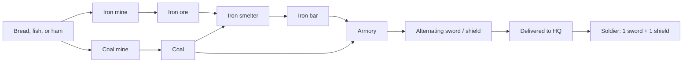

# Gameplay Balance Assessment

This assessment reviews the current new-game economy, military expansion loop, weapon production chain, mineral model, and enemy engagement path.

## Executive verdict

The current build is playable into early and mid military expansion, but the balance is generous in construction materials and fragile in strategic clarity. The player starts with enough boards, stone, tools, food, ore, bars, swords, and shields to build a small military front and bootstrap an armory chain without getting stuck immediately.

The biggest issue is not that starting resources are too low. The bigger issue is that some late-war constraints are either abstracted or not yet connected:

- Mines say they extract underground deposits, and surveying exposes mineral numbers, but mines currently do not require or deplete `Tile.cellMinerals`.
- Enemy realms do not run a full economy; they reinforce garrisons through timed abstraction.
- There is no formal whole-map victory condition or conquest summary.
- Initial sword/shield stock supports only 5 soldiers, which is fine for first expansion, but too low for players who build high-capacity posts first and expect them to fill.

Recommendation: do not broadly raise all starting resources. Instead, modestly improve military onboarding and make the mineral/war goals more explicit. If a single numerical change is desired, increasing starting `sword` and `shield` from `5` to `8` each is the safest targeted buff.

## Current starting stock

New games seed the headquarters from `GAME_CONFIG.starting.baseCamp.startingResources`:

- Construction runway: `wood_plank: 48`, `stone: 48`, `wood_log: 20`.
- Mine and weapon runway: `coal: 16`, `iron_ore: 8`, `iron_bar: 8`, `gold_ore: 4`.
- Food runway: `bread: 16`, `fish: 12`, `ham: 8`, plus `grain: 16`, `water: 8`.
- Tool runway: `axe: 6`, `saw: 4`, `pickaxe: 8`, `shovel: 4`, `fishing_rod: 4`, `scythe: 4`, `hammer: 4`, `rolling_pin: 2`, `crucible: 2`, `tongs: 2`, `cleaver: 2`, `bow: 2`.
- Military runway: `sword: 5`, `shield: 5`.
- Population runway: `startingPopulation: 100`, while HQ housing capacity provides `15`.

The material stock is enough to build most core chains many times over if considered in isolation. The effective bottleneck is not boards or stone. It is weapons, road logistics, tools being assigned to buildings, and production-chain understanding.

## Military expansion capacity

Military buildings all project a Chebyshev radius-12 territory disk for the player, but garrisoned military posts only contribute territory after at least one soldier arrives.

Current post costs and capacities:

- `barracks`: costs `2 wood_plank`, capacity 2 soldiers, radius 12.
- `guardhouse`: costs `2 wood_plank + 3 stone`, capacity 3 soldiers, radius 12.
- `watchtower`: costs `3 wood_plank + 4 stone`, capacity 6 soldiers, radius 12.
- `fortress`: costs `4 wood_plank + 7 stone`, capacity 9 soldiers, radius 12.
- `lookout_tower`: costs `4 wood_plank`, uses `bow`, requires 1 worker, radius 12, no soldier capacity.

From starting construction stock alone, the player can afford many posts:

- 24 barracks, if only boards mattered.
- 16 guardhouses.
- 12 watchtowers.
- 6 fortresses.
- 12 lookout towers.

But from starting weapons, the player can only create 5 soldiers. That means:

- 5 separate military posts can be activated with one soldier each.
- 2 barracks can be fully filled, with one soldier left.
- 1 guardhouse can be fully filled, with two soldiers left.
- 0 watchtowers or fortresses can be fully filled from starting weapons.

This creates a design tension. Because any garrisoned post projects the same radius-12 disk, the optimal early expansion is to place cheap barracks or lightly staffed higher-tier posts, not to fully fill large forts. That can be fun if intentional, but the game should communicate it clearly.

## Sustainable sword and shield chain

The implemented chain for replacement soldiers is:

Minimum building costs for a basic sustainable weapon chain:

- `coal_mine`: `4 wood_plank`, needs `pickaxe`.
- `iron_mine`: `4 wood_plank`, needs `pickaxe`.
- `iron_smelter`: `2 wood_plank + 2 stone`, needs `crucible`.
- `armory`: `2 wood_plank + 2 stone`, needs `hammer`.

Total: `12 wood_plank + 4 stone`, plus workers/tools and road connection. This is comfortably affordable from the starting stock, leaving about `36 wood_plank` and `44 stone` before roads and other supporting buildings.

The starting stock also includes enough raw inputs to make additional weapons even before mining ramps:

- Starting `sword/shield` directly creates 5 soldiers.
- Starting `coal: 16`, `iron_ore: 8`, and `iron_bar: 8` can support up to 12 armory cycles if 4 ore is smelted into bars first.
- Since the armory alternates sword then shield, that can bring total available pairs to about 11 before new mined ore is required, assuming transport keeps up.

This means the game is not starved on iron or coal at start. The risk is that players may spend early bars on `metalworks` tool production, overbuild military posts, or fail to connect/deliver resources, and then perceive the economy as stuck.

## Expansion scenarios

### Scenario 1: early scouting and safe expansion

The player can immediately build several cheap territory anchors. With 5 starting sword/shield pairs, the practical early pattern is:

- Build up to 5 soldier-bearing posts with one soldier each, usually `barracks`.
- Use `lookout_tower` for territory expansion when the player wants to preserve swords and shields.
- Avoid filling `watchtower` or `fortress` garrisons early, because their high capacity does not increase territory radius.

This scenario is healthy if the UI teaches the one-soldier territory rule. Without that explanation, players may build expensive-looking large posts, fail to fill them, and assume resources are too low.

### Scenario 2: first military border push

The first real push toward the passive nearby realm should be viable from starting resources:

- Construction materials can easily cover several posts and the basic production chain.
- Starting weapons activate 5 posts, enough to chain multiple radius-12 disks.
- Initial raw ore/bar/coal stock can raise total available sword/shield pairs to about 11 before new mined ore is strictly required, assuming the armory output is delivered back to HQ.

The main risk in this phase is logistics opacity. Weapons in an armory output buffer do not count for training until road workers deliver them to HQ.

### Scenario 3: sustainable war economy

Longer conquest requires a functioning loop of mines, smelter, armory, and food:

- `iron_mine` produces `iron_ore` from one mine-food unit.
- `coal_mine` produces `coal` from one mine-food unit.
- `iron_smelter` turns `1 iron_ore + 1 coal` into `1 iron_bar`.
- `armory` turns `1 iron_bar + 1 coal` into alternating `sword` and `shield`.
- A full soldier pair therefore requires two armory cycles, or `2 iron_bar + 2 coal` at the armory.

If all upstream inputs are mined from scratch, each extra soldier pair needs about 2 iron-mine food cycles and 4 coal-mine food cycles. This makes food production relevant for sustained conquest, but the starting `bread + fish + ham` stock is enough to avoid an immediate mining dead-end.

### Scenario 4: late enemy conquest

Farther enemy villages are much stronger than the starting realm. The generated enemy scale reaches dozens of defenders in later villages, with rank-2 and rank-3 soldiers:

- Villages 0-2 are plausible early/mid targets.
- Villages 3-5 require a larger promoted force.
- Villages 6-9 are late-game objectives and should assume mature armory, mining, food, and gold-coin promotion loops.

This is acceptable for a map-conquest game, but the current prototype needs a formal victory tracker and more late-game feedback before these numbers can be considered final.

## Food and mining

Mines require one unit per cycle from an OR group: `bread`, `ham`, or `fish`.

Current starting food can run mines for a while:

- `bread: 16`
- `fish: 12`
- `ham: 8`

That is 36 mine-food cycles before new food production matters, shared across coal, iron, gold, and granite mines. For the weapon chain specifically, one iron ore plus one coal becomes one iron bar, then one iron bar plus one coal becomes one armory output. So a sword/shield pair requires two armory outputs, which requires:

- 2 iron bars.
- 2 coal at armory.
- To create those bars from mined ore: 2 iron ore and 2 more coal.
- Total if fully mined from scratch: 2 iron mine food cycles and 4 coal mine food cycles per soldier pair, plus smelter/armory time.

That makes food meaningful for sustained war, but the starting mix is enough to avoid an early hard stop.

## Mineral and iron availability

Surveyed cell minerals are deterministic and lazy. A rolled cell has 10 mineral units split across `coal`, `iron_ore`, `gold_ore`, and `stone`, with each unit uniformly selected.

For iron per surveyed cell, the distribution is approximately:

- 0 iron: 5.63%
- 1 iron: 18.77%
- 2 iron: 28.16%
- 3 iron: 25.03%
- 4 iron: 14.60%
- 5 or more iron: 7.81%
- Expected iron: 2.5 per cell.

If the game eventually uses surveyed minerals as real mine stock, iron should be common enough across the 1000x1000 map. It may be scarce only at a very local level, which is good for exploration.

However, in the current implementation, mines do not read or deplete `Tile.cellMinerals`. `mine_site` production checks food, road connection, operator, output buffer, and mine worker animation, but not the surveyed ore content. This means the current answer to “is there enough iron in the cells?” is: yes statistically, but it does not currently matter mechanically.

This is the most important design gap in the resource model. Survey is useful for labels and fantasy, but not yet for mine viability or strategic expansion.

## Enemy engagement and conquest

Enemy villages scale strongly by index:

- Village 0: 1 barracks, about 1 rank-1 defender, passive aggression level 0.
- Village 1: 1 guardhouse, about 2 rank-1 defenders.
- Village 2: 2 military buildings, about 4 rank-1 defenders.
- Village 3: 3 military buildings, about 8 rank-2 defenders.
- Village 4: 4 military buildings, about 13 rank-2 defenders.
- Village 5: 5 military buildings, about 17 rank-2 defenders.
- Village 6: 6 military buildings, about 33 rank-2 defenders.
- Village 7: 6 military buildings, about 39 rank-3 defenders.
- Village 8: 7 military buildings, about 51 rank-3 defenders.
- Village 9: 8 military buildings, about 54 rank-3 defenders.

AI raids begin only when an activated non-passive enemy shares a cardinal territory boundary with the player. Attack pressure then depends on aggressiveness:

- Level 0: never attacks.
- Level 1: first attack after 240 seconds, then 360-second cooldown, max 1 attacker.
- Level 2: first attack after 210 seconds, then 300-second cooldown, max 2 attackers.
- Level 3: first attack after 180 seconds, then 240-second cooldown, max 3 attackers.
- Level 4: first attack after 150 seconds, then 180-second cooldown, max 4 attackers.
- Level 5: first attack after 120 seconds, then 150-second cooldown, max 5 attackers.

Enemy garrisons reinforce abstractly every 45 seconds while bordering. This makes enemies durable enough for pressure, but it also means the player is not racing an enemy economy. The current conquest loop is more of a tactical territory-pressure prototype than a full RTS strategic simulation.

## Playability gaps

1. No formal victory condition.
   Capturing enemy HQs and posts transfers ownership and territory, but there is no implemented whole-map victory screen, conquest score, or “all enemy realms defeated” state.

2. Minerals are not binding.
   Surveyed iron and ore labels do not gate mine placement, production, or depletion. This can make survey feel disconnected from the military supply chain.

3. Large military buildings are misleading early.
   A fortress is cheap enough to build from starting stock but impossible to fill early. Since a single soldier activates the same radius as a barracks, players may not understand the difference between “territory anchor” and “combat reserve.”

4. Enemy economy is abstract.
   Enemy reinforcements are timer-driven, not produced from enemy food/weapons. This is acceptable for a prototype, but it limits balance conclusions about long wars.

5. Logistics failure can look like resource shortage.
   The armory only helps soldier training after weapons are physically delivered to HQ. If transport routes are disconnected or saturated, the player may see “Need sword and shield at HQ” despite having output in an armory buffer.

6. Gold promotions are optional but strategically important.
   Rank weights are 1, 1.6, and 2.4. Late villages are full of rank-3 defenders, so conquering the far map likely requires mint/gold infrastructure or overwhelming numbers.

## Recommendations

### Keep most starting resources as-is

The starting economy is not globally too low. It can build the full weapon chain, several military posts, food infrastructure, and early production support. Raising boards, stone, coal, or iron broadly would likely remove meaningful early choices.

### Consider increasing starting weapons to 8 each

The current `5 sword + 5 shield` starts the player safely but narrowly. Increasing both to 8 would:

- Let players fill four barracks, or activate up to eight posts.
- Give a better buffer against early experimentation.
- Still require armory/smelter/mine infrastructure for sustained conquest.
- Avoid buffing unrelated economy chains.

This is the most targeted “more fun, less stuck” change.

### Make mineral strategy explicit

Choose one direction:

1. Keep survey informational for now.
   If so, update UI/docs copy so mines do not imply they depend on surveyed cell stock.

2. Make mines deposit-gated later.
   If so, require mine placement on or near matching surveyed minerals, decrement cell stock per output, and add clear depletion feedback. This would make “enough iron in the world” a real balance question.

For current playability, option 1 is safer. Option 2 is better long-term, but it needs UX support and probably larger local vein sizes than 10 units per cell.

### Clarify early military strategy

The game should tell players that:

- One soldier activates a military post’s territory disk.
- More soldiers increase combat strength, not territory radius.
- Weapons must be at HQ, not sitting in an armory buffer.
- Lookout towers expand territory without consuming sword/shield pairs, but need a bow/scout worker.

This could be done in popovers/tooltips before changing numbers.

### Add a conquest endpoint

For the current “conquer the whole map” goal, add a formal victory tracker before doing deep economy rebalance:

- Count enemy-owned HQs and military buildings.
- Trigger victory when no enemy faction owns a headquarters or military post.
- Show a conquest summary: realms defeated, soldiers lost, buildings captured.

Without this, the end game exists mechanically but not experientially.

### Treat late enemy realms as a future balance pass

Difficulty jumps hard after village 5. Villages 6-9 can have 33-54 defenders, many at rank 2 or 3. That is acceptable as a far-map challenge, but only if the player has a mature war economy and promotion pipeline. The late game should not be balanced only by starting stock.

## Suggested balance stance

Current starting resources are adequate for fun early play. They are not obviously too low. The stronger case is for improving clarity and adding a small military cushion.

Recommended near-term changes to consider later:

1. Raise starting `sword` and `shield` from `5` to `8`.
2. Add UI copy explaining one-soldier territory activation and HQ-only weapon consumption.
3. Decide whether surveyed minerals are cosmetic/informational or a real mine constraint.
4. Add a formal conquest victory condition.
5. Reassess late enemy defender counts after the victory loop and mineral decision are implemented.

Until mines consume mineral deposits and enemies run a real economy, the game can be balanced for “fun prototype conquest,” but not yet for a fully closed strategic economy.
